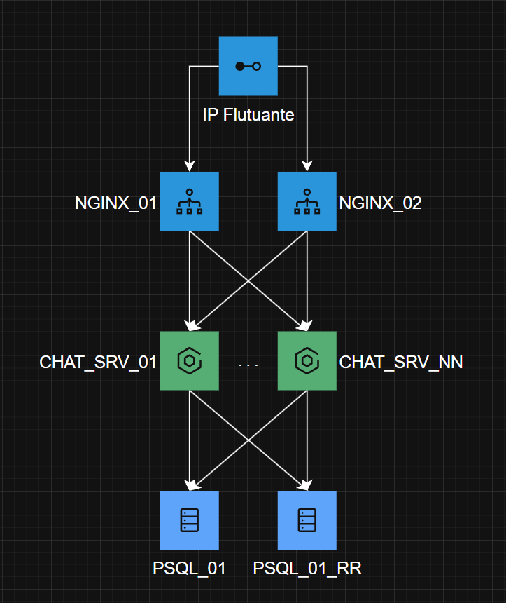

# Chat IPCA - Infraestrutura Distribuída e Alta Disponibilidade

Este repositório contém a Prova de Conceito (PoC) para a infraestrutura de um sistema de Chat seguro, altamente disponível e distribuído. O ambiente foi totalmente desenhado utilizando **Docker Compose** e corre sobre uma máquina virtual **Debian (instalação mínima)** no Hyper-V.

## 🏗️ Arquitetura do Sistema

A infraestrutura foi projetada seguindo as melhores práticas de resiliência, tolerância a falhas (*Failover*) e distribuição de carga (*Load Balancing*):



### Componentes Principais:
1. **Camada de Entrada (Proxy & Load Balancer):** Dois nós **Nginx** em paralelo que distribuem o tráfego de forma equitativa e garantem redundância.
2. **Camada de Autenticação (IAM):** Clusterizado com **Authelia** (em modo *Forward Auth*), protegendo a aplicação com um sistema de login centralizado sem necessidade de alterar o código-fonte do chat.
3. **Camada de Aplicação:** Múltiplas instâncias do servidor de Chat isoladas e balanceadas pelo Nginx.
4. **Camada de Persistência (Dados):** Cluster **PostgreSQL** com replicação síncrona/assíncrona (Master-Slave) gerido por um **Pgpool-II**, que faz o balanceamento das consultas de leitura e garante o failover automático do banco de dados.

---

## 📁 Estrutura de Diretórios

O projeto adota o padrão *Monorepo*, organizando a infraestrutura e configurações de forma modular:

```text
chat-ipca/
├── .gitignore                  # Regras de exclusão para o Git (dados locais e logs)
├── README.md                   # Documentação principal do projeto
└── chat-infra/                 # Ficheiros de configuração da infraestrutura
    ├── docker-compose.yml      # Orquestração de todos os containers do cluster
    ├── nginx.conf              # Configuração de Load Balancing e regras do Authelia
    ├── authelia/               # Configurações do sistema de autenticação
    │   ├── configuration.yml
    │   └── users_database.yml
    └── postgres-init/          # Scripts de inicialização automática do cluster SQL
        └── init-multiple-databases.sql

#
